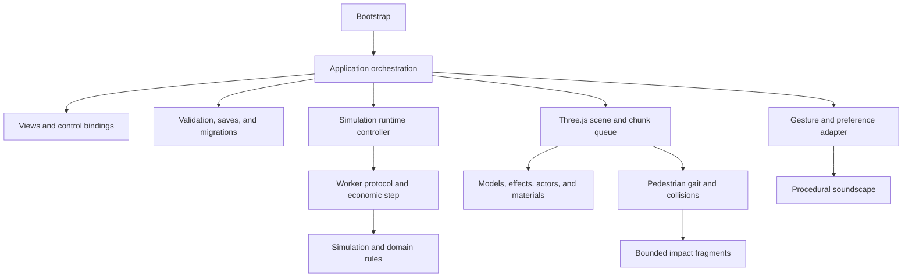

# Neustadt architecture

This guide describes the v3.0.0 development structure. Final browser acceptance and release publication are still pending. The refactor separates responsibilities without changing the established five-second economic cadence or the existing in-game currency.

## Module map

| Area | Entry points and responsibility |
| --- | --- |
| Bootstrap | `src/main.ts` loads styles and starts the application. |
| Application | `src/app/application.ts` coordinates city state, user actions, scene synchronization, save requests, and simulation results. `frame-loop.ts` owns frame scheduling; `audio-session.ts` bridges user gestures and browser preferences to audio. |
| User interface | `src/ui/views/` renders individual panels. Focus, dialogs, keyboard controls, palettes, previews, menus, and individual control bindings live in `src/ui/`; styles live in `src/ui/styles/`. |
| Shared domain | `src/domain/types.ts` defines city and tile contracts. `src/i18n/` provides locale selection and translated text. |
| Simulation | `src/simulation/city-simulation.ts` is a public facade. Catalog, city queries, tile operations, generation, networks, economy, construction, growth, disasters, events, progression, calendar, and weather each have an owning module. |
| Worker runtime | `src/simulation/runtime/` owns the transport controller, typed request/response protocol, and worker entry point. |
| Persistence | `src/persistence/` separates validation, serialization, migration, browser storage, and preference access. |
| Construction and lots | `src/construction/` owns gestures and session undo. `src/buildings/` owns lot identity, dimensions, and facility access rules. `src/infrastructure/` owns power-network rules. |
| Rendering | `src/rendering/scene.ts` coordinates the Three.js scene. `scene/` owns chunk construction, queues, geometry helpers, timing, and diagnostics. |
| Building graphics | `src/rendering/buildings/models.ts` is the model facade. Primitives, shared materials, architecture, facilities, actors, window lights, rural models, and specialized assets live in focused modules beside it. |
| Other graphics | `src/rendering/world/`, `infrastructure/`, `lighting/`, `effects/`, and `vehicles/` own their scene representations. |
| Traffic and vehicles | `src/traffic/` owns lanes, networks, flow, and intersection control; `src/vehicles/` owns player driving and collision/contact behavior. |
| Residents and wildlife | `src/citizens/` owns resident behavior and routing, with bilingual dialogue catalogs in `dialogue/`. `src/wildlife/` owns animals. |
| World | `src/world/` owns seeded terrain, starting scenarios, and persistent rural classification. |
| Audio | `src/audio/soundscape.ts` synthesizes and mixes sound. The module accepts scene observations and preferences without owning DOM or storage. |

## Dependency direction

The worker-reachable simulation graph is acyclic and does not depend on Three.js or browser DOM APIs. Pure rules operate on city data; rendering and interface code consume those rules and their results. Keep browser storage in persistence and user-gesture handling in the application adapter. Model factories must not become alternate owners of simulation state.

The arrows show responsibility flow, not every individual import. Pure simulation leaf modules should import their owning leaf dependencies instead of routing internal dependencies back through the public facade. This avoids accidental cycles as the facade grows.

## State and worker lifecycle

The application owns the live city. At an economic boundary, the runtime sends a structured-cloned snapshot to a module Web Worker. The request includes its sequence ID, runtime epoch, base city revision, city identity, and locale. The worker executes one economic step on that isolated snapshot and returns the resulting city and elapsed calculation time.

Only one request may be in flight; there is no unbounded work backlog. The application owns elapsed simulation time and decides when another step is due. Results are accepted only while their request identity, epoch, base revision, and city identity still match. The application additionally checks that its live city is still the source object. City replacement or simulation-input changes invalidate the runtime; an outstanding worker is stopped so its result cannot overwrite newer edits.

Worker exceptions, unreadable messages, and timeouts resolve the pending step without applying a result, terminate that worker, and expose a diagnostic. A subsequent request can create a fresh worker. There is no claim that moving economic steps off the main thread removes all main-thread work: construction, structured cloning, UI updates, and scene creation still have costs.

## Rendering and budgets

The scene separates world and building chunks, shares geometry/material resources where appropriate, and queues changed building chunks. Queue priority favors visible chunks near the camera. Incremental processing uses a cooperative target of four milliseconds. It checks elapsed time between units of work; one expensive unit can exceed the target, so this is not a strict upper bound on frame time.

Initial scene creation remains synchronous. Large cities can still incur substantial load, memory, draw-call, and rebuild costs. Ordinary traffic models use instanced batches. Pedestrians favor developed frontage and omit off-camera rendering while preserving interactive actors. The finite terrain plate closes its edges and underside; screen-space ambient occlusion is not part of the current renderer. Shader-driven rain covers the map. Puddles use eight instanced geometry groups and sky-environment reflections; they do not implement accurate local building reflections.

CPU metrics aggregate last, maximum, and mean duration for named work. Optional `EXT_disjoint_timer_query_webgl2` queries measure GPU duration asynchronously, without waiting for results. Unsupported browsers report GPU timing as unavailable; disjoint samples are discarded. Neither diagnostic establishes a universal frame-rate guarantee.

## Persistent identity and assets

City serialization preserves lot anchors, dimensions, orientation, rural commercial identity, and progression. Current-format maps retain their dimensions, including legacy 128 × 128 maps. Original v1 migration creates the additional space needed for larger facilities. Construction and disaster undo remain session state, separate from saved city history.

New own-city generation targets 128 × 128 with a substantial level center and outer mountain regions; the authored New York map remains 96 × 96. Existing smaller maps remain supported and can expand directly to 128 × 128.

A rural commercial lot's `ruralCommercial` flag is domain identity, not a camera-dependent rendering decision. Meadow decoration is visual; lake recreation validates a usable water route before showing its three windsurfers and rowing boat. Beach construction is an explicit shoreline action.

The unique office-building Easter Egg uses neutral source and asset identifiers and appears at most once per map. The fourth qualifying medium-density business opening can claim its reserved lot and clear landscaped frontage. New presets include the forecourt; explicit relocation is not a load migration. Its reserved lot identity belongs to the domain; its optimized model belongs to rendering. See [asset provenance](../public/assets/models/easter-egg-office-README.md). Keep original source file names and private absolute paths out of published metadata.

## Pedestrian collision state

Resident gait and collision handling remain in the citizen system. `src/citizens/impact-debris.ts` owns bounded visual body-part fragments for strong fictional impacts: six per affected figure, at most 48 active parts, expiring after twelve seconds. Ordinary falls should recover without triggering that effect. The latest gait, fall-recovery, and collision integrations remain under acceptance and need real scene checks as well as focused tests.

## Audio lifecycle

The soundscape is inert until a real pointer or keyboard gesture unlocks Web Audio. The application audio session owns those listeners, preference persistence, visibility handling, and updates at approximately ten hertz. Audio preferences are browser settings, not city-export fields.

The sound module synthesizes an original score and environmental effects locally. Master, music, effects, and ambience have separate levels; music also has an independent enable switch. Sound observations include vehicle speed, driving throttle, weather, position, water, turbines, and active aircraft. Spatial categories use a bounded source selection. Sirens require an explicitly marked moving vehicle; parked emergency vehicles do not automatically sound an alarm.

Pausing fades traffic, engine, siren, and aircraft sounds while the score and stationary ambience can continue. Hidden tabs mute playback and do not accumulate a musical catch-up queue. Dispose the session to remove listeners and release the audio graph. See [audio module notes](../src/audio/README.md) for synthesis budgets and focused verification.

## Verification and contribution

Use `npm run format` to format maintained source, tests, and tooling, and `npm run format:check` to check formatting without edits. Run `npm run check:architecture` for dependency-boundary checks, `npm test` for the recursively discovered, domain-organized automated suite, and `npm run build` for TypeScript validation and a production bundle. `npm run typecheck` checks types without building. Keep tests beside their corresponding test-domain group; do not depend on one flat root-level test glob. Browser acceptance is still necessary for input, sound balance, visual continuity, performance, and save/reload behavior.

When adding a feature, identify its domain owner before editing the application or scene coordinators. Add pure rules to simulation/world/building modules, persistence contracts to validation and serialization, graphics to focused rendering modules, and controls to UI views/bindings. Keep both languages synchronized. Preserve worker invalidation whenever a user action changes simulation inputs, even if that action does not increment the city revision.

The final v3 release gate includes small-city and large-city play, worker stale-result checks, actual audio gesture unlock and listening, airport flight-path visibility, daytime/nighttime/rain inspection, and save/import/reload checks. Automated geometry and state tests support these checks but do not replace them.
